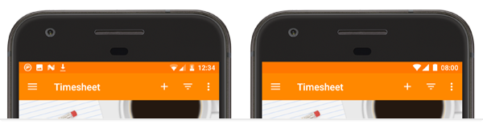

# Fastlane Plugin: demo_mode

[](https://rubygems.org/gems/fastlane-plugin-demo_mode)

## Getting Started

This project is a [fastlane](https://github.com/fastlane/fastlane) plugin. To get started with `fastlane-plugin-demo_mode`, add it to your project by running:

```bash
fastlane add_plugin demo_mode
```

## About demo_mode

This fastlane plugin sets your connected android devices to demo mode. It allows you to manipulate the status bar to make nice and clear screenshots.



## Example

Check out the [example `Fastfile`](fastlane/Fastfile) to see how to use this plugin. Try it by cloning the repo, running `fastlane install_plugins` and `bundle exec fastlane test`.

You could run `demo_mode` before `screengrab` and deactivate it after `screengrab` has finished.

```
lane :test do

  demo_mode(
    clock: "0800",
    wifi: true,
    wifi_level: 4,
    mobile: true,
    mobile_datatype: "lte",
    mobile_level: 4,
    plugged: false,
    battery: 100,
    notifications: false)

  screengrab

  demo_mode(deactivate: true)

end
```

## Parameter Values
**clock:** ["0000"-"2359"]  
**wifi:** true | false  
**wifi_level:** [0-4]  
**mobile:** true | false  
**mobile_datatype:** "1x" | "3g" | "4g" | "4g+" | "e" | "g" | "h" | "lte" | "lte+" | "roam"  
**mobile_level:** [0-4]  
**plugged:** true | false  
**battery:** [0-100]  
**notifications:** true | false  
**deactivate:** true | false

## Run tests for this plugin

To run both the tests, and code style validation, run

```
rake
```

To automatically fix many of the styling issues, use
```
rubocop -a
```

## Issues and Feedback

For any other issues and feedback about this plugin, please submit it to this repository.

## Troubleshooting

If you have trouble using plugins, check out the [Plugins Troubleshooting](https://docs.fastlane.tools/plugins/plugins-troubleshooting/) guide.

## Using `fastlane` Plugins

For more information about how the `fastlane` plugin system works, check out the [Plugins documentation](https://docs.fastlane.tools/plugins/create-plugin/).

## About `fastlane`

`fastlane` is the easiest way to automate beta deployments and releases for your iOS and Android apps. To learn more, check out [fastlane.tools](https://fastlane.tools).
